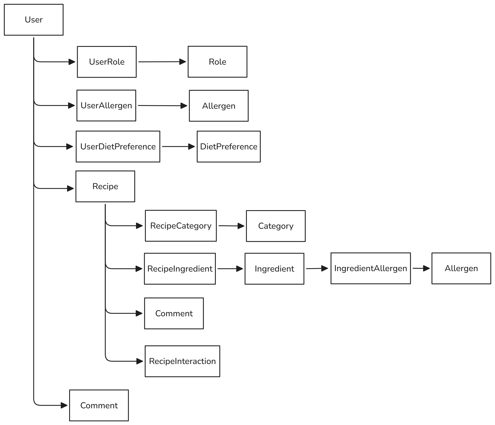

# Entity-Relationship Diagram (ERD) definitivo

Este ERD é a fonte da verdade para:

- Prisma
- Swagger
- Controllers
- Services
- Permissões
- Queries do Dashboard

## Desenho do ERD

Desenho de ERD: [Link do Excalidraw](https://excalidraw.com/#json=M7Mq_K4ZC48ENxiMvpVFz,FabM5o5vcTSkXoOskd-u8Q)

## Descrição das entidades

### `User`

| Campo        | Tipo     |
| ------------ | -------- |
| id           | UUID     |
| name         | String   |
| username     | String   |
| email        | String   |
| passwordHash | String   |
| avatarUrl    | String?  |
| bio          | String?  |
| role         | RoleName |
| createdAt    | DateTime |
| updatedAt    | DateTime |

**Relacionamentos:**

- User 1:N Recipe
- User 1:N Comment
- User 1:N Category (sugestões criadas)
- User 1:N Ingredient (sugestões criadas)
- User N:N Allergen
- User N:N DietPreference
- User 1:N RecipeInteraction

### `UserAllergen`

| Campo      | Tipo |
| ---------- | ---- |
| userId     | UUID |
| allergenId | UUID |

**Relacionamentos:**

- UserAllergen N:1 User
- UserAllergen N:1 Allergen

**Observação:**

A relação entre User e Allergen é N:N e é implementada através da entidade UserAllergen.

### `Allergen`

Representa substâncias que podem causar reações alérgicas e que serão utilizadas para filtrar receitas incompatíveis com o perfil do usuário.

| Campo | Tipo   |
| ------| ------ |
| id    | UUID   |
| name  | String |

**Exemplos:**

- Glúten
- Leite
- Ovo
- Soja
- Amendoim
- Castanhas

**Relacionamentos:**

- Allergen N:N User (através de UserAllergen)
- Allergen N:N Ingredient (através de IngredientAllergen)

---

### `UserDietPreference`

| Campo            | Tipo |
| ---------------- | ---- |
| userId           | UUID |
| dietPreferenceId | UUID |

**Relacionamentos:**

- UserDietPreference N:1 User
- UserDietPreference N:1 DietPreference

**Observação:**

A relação entre User e DietPreference é N:N e é implementada através da entidade UserDietPreference.

### `DietPreference`

Representa preferências ou restrições alimentares do usuário.

| Campo | Tipo   |
| ------| ------ |
| id    | UUID   |
| name  | String |

**Exemplos:**

- Vegano
- Vegetariano
- Sem Lactose
- Sem Glúten
- Low Carb

**Relacionamentos:**

- DietPreference N:N User (através de UserDietPreference)
- DietPreference N:N Recipe (através de RecipeDietPreference)

---

### `Recipe`

| Campo                    | Tipo             |
| ------------------------ | ---------------- |
| id                       | UUID             |
| title                    | String           |
| description              | String           |
| preparationMethod        | String           |
| preparationTimeMinutes   | Integer          |
| difficulty               | Difficulty       |
| imageUrl                 | String           |
| status                   | ModerationStatus |
| authorId                 | UUID (User.id)   |
| createdAt                | DateTime         |
| updatedAt                | DateTime         |

**Relacionamentos:**

- Recipe N:1 User
- Recipe N:N Category
- Recipe N:N Ingredient
- Recipe N:N DietPreference
- Recipe 1:N Comment
- Recipe 1:N RecipeInteraction

---

### `RecipeCategory`

| Campo      | Tipo |
| ---------- | ---- |
| recipeId   | UUID |
| categoryId | UUID |

**Relacionamentos:**

- RecipeCategory N:1 Recipe
- RecipeCategory N:1 Category

### `Category`

Representa categorias utilizadas para classificar receitas.

| Campo       | Tipo             |
| ------------| ---------------- |
| id          | UUID             |
| name        | String           |
| status      | ModerationStatus |
| createdById | UUID (User.id)   |
| createdAt   | DateTime         |

**Exemplos:**

- Sobremesa
- Fitness
- Vegana
- Massa
- Bebida

**Relacionamentos:**

- Category N:N Recipe
- Category N:1 User (criador da sugestão)

---

### `RecipeIngredient`

Tabela intermediária responsável por armazenar ingredientes e suas quantidades dentro de cada receita.

| Campo        | Tipo    |
| ------------ | ------- |
| id           | UUID    |
| recipeId     | UUID    |
| ingredientId | UUID    |
| quantity     | Decimal |
| unit         | String  |

**Exemplos:**

| Ingrediente | Quantidade | Unidade  |
| ----------- | ---------- | -------- |
| Farinha     | 500        | g        |
| Leite       | 200        | ml       |
| Ovo         | 2          | un       |

**Relacionamentos:**

- RecipeIngredient N:1 Recipe
- RecipeIngredient N:1 Ingredient

### `Ingredient`

Representa ingredientes aprovados ou pendentes de aprovação.

| Campo       | Tipo             |
| ------------| ---------------- |
| id          | UUID             |
| name        | String           |
| status      | ModerationStatus |
| createdByid | UUID (User.id)   |
| createdAt   | DateTime         |

**Relacionamentos:**

- Ingredient N:N Recipe
- Ingredient N:N Allergen
- Ingredient N:1 User (criador da sugestão)

---

### `IngredientAllergen`

Tabela intermediária responsável por relacionar ingredientes aos alergênicos que eles possuem.

| Campo        | Tipo |
| ------------ | ---- |
| ingredientId | UUID |
| allergenId   | UUID |

**Relacionamentos:**

- IngredientAllergen N:1 Ingredient
- IngredientAllergen N:1 Allergen

---

### `RecipeDietPreference`

Tabela intermediária utilizada para identificar quais dietas são compatíveis com determinada receita.

| Campo            | Tipo |
| ---------------- | ---- |
| recipeId         | UUID |
| dietPreferenceId | UUID |

**Relacionamentos:**

- RecipeDietPreference N:1 Recipe
- RecipeDietPreference N:1 DietPreference

---

### `Comment`

| Campo     | Tipo     |
| ----------| -------- |
| id        | UUID     |
| content   | String   |
| recipeId  | UUID     |
| userId    | UUID     |
| createdAt | DateTime |
| updatedAt | DateTime |

**Relacionamentos:**

- Comment N:1 User
- Comment N:1 Recipe

---

### `RecipeInteraction`

Representa as ações de Swipe realizadas pelos usuários.

| Campo     | Tipo            |
| ----------| --------------- |
| id        | UUID            |
| recipeId  | UUID            |
| userId    | UUID            |
| type      | InteractionType |
| createdAt | DateTime        |

**Relacionamentos:**

- RecipeInteraction N:1 User
- RecipeInteraction N:1 Recipe

**Restrição de unicidade:**

- (userId, recipeId) deve ser único.

**Observação:**

Um usuário pode possuir apenas uma interação ativa por receita.

Não é permitido que o mesmo usuário possua simultaneamente interações SMASH e PASS para a mesma receita.
