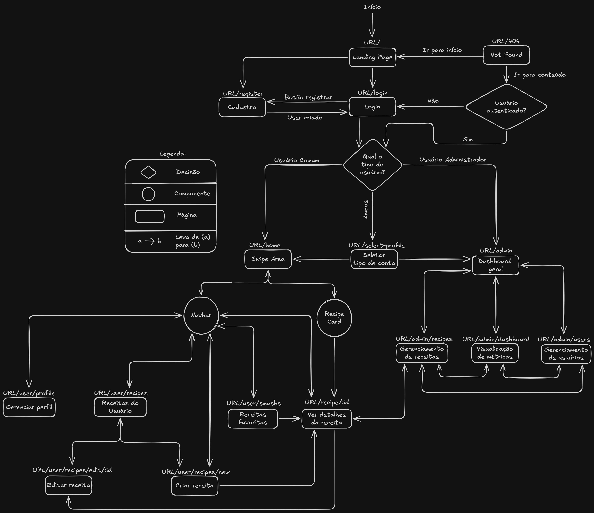

# Mapa de Navegação e Fluxo da Aplicação

## Visão Geral

O mapa de navegação e fluxo da aplicação é uma representação visual das principais telas e rotas do sistema, mostrando como os usuários interagem com a aplicação e como as diferentes áreas estão conectadas. Ele serve como um guia para entender a estrutura da aplicação, os caminhos que os usuários podem seguir e as funcionalidades disponíveis em cada etapa da jornada.

[Link do Excalidraw](https://excalidraw.com/#json=SGJ2ywg8EdmPXYAVA5YH1,-YJGRx00Se8qbb2sOuNPRg)

## Sobre cada tela

**Para todos os usuários:**

- **Landing Page** (URL/): Ponto de entrada da aplicação. Apresenta a proposta do sistema e direciona o usuário para login, cadastro ou, se já estiver autenticado, para a área correspondente ao seu perfil. Se comunica com a autenticação do front para decidir o redirecionamento inicial.
- **Login** (URL/login): Tela de autenticação. Recebe as credenciais do usuário, envia a validação para o backend e, após o login, encaminha para a rota correta de acordo com o tipo de conta e permissões.
- **Cadastro** (URL/register): Tela de criação de conta. Envia os dados do novo usuário para o backend, cria o cadastro e prepara o fluxo para o próximo passo da jornada, normalmente login ou seleção de perfil.
- **Not Found** (URL/404*): Página de erro para rotas inexistentes. Exibe uma mensagem amigável e um link para retornar à landing page ou à área principal do usuário ou tela de login, dependendo do contexto da sessão.

---

**Para usuários administradores autenticados:**

- **Dashboard Geral** (URL/admin): Hub principal do administrador. Centraliza os atalhos para as áreas de gestão e consome dados resumidos do backend para mostrar o panorama geral da aplicação.
- **Visualizar Métricas** (URL/home/dashboard): Tela analítica com indicadores e gráficos. Busca informações agregadas no backend, é acessada a partir do dashboard geral.
- **Gerenciar Receitas** (URL/admin/recipes): Área administrativa de CRUD de receitas. Conversa com os endpoints de receitas e seus comentários para listar, editar e remover registros.
- **Gerenciar Usuários** (URL/admin/users): Área administrativa de gestão de contas. Usa os serviços de usuários no backend para listar perfis, alterar permissões e manter os cadastros.

---

**Para usuários comuns autenticados:**

- **Swipe Area** (URL/home): Área principal do usuário comum. Exibe cards de receitas para interação rápida e se comunica com o backend para carregar conteúdos e registrar ações como Smash ou Pass.
- **Gerenciar Perfil** (URL/user/profile): Tela de edição dos dados pessoais. Envia atualizações do perfil para o backend e mantém o estado do usuário sincronizado com a sessão.
- **Receitas do Usuário** (URL/user/recipes): Lista das receitas criadas pelo próprio usuário. Busca os itens no backend e serve como ponto de entrada para detalhes, edição, exclusão e interação com comentários.
- **Editar Receita** (URL/user/recipes/edit/:id): Formulário de edição de uma receita específica. Carrega os dados pelo identificador e grava as alterações no backend.
- **Criar Receita** (URL/user/recipes/new): Formulário de criação de nova receita. Envia o conteúdo cadastrado para o backend e, ao finalizar, atualiza a lista de receitas do usuário.
- **Visualizar Receita** (URL/recipes/:id): Página de detalhes de uma receita. Busca os dados pelo id e pode servir para edição (caso o usuário seja o dono) ou comentários.
- **Receitas Favoritas** (URL/user/smashs): Lista de receitas salvas como favoritas (Smashs). Consulta o backend para carregar os itens marcados e permite voltar para a visualização detalhada de cada receita.

---

**Para usuários que são comuns e administradores autenticados:**

- **Select Profile** (URL/select-profile): Tela intermediária para quem tem mais de um tipo de acesso. Permite escolher o perfil ativo da sessão e define para qual área da aplicação o usuário será redirecionado.
